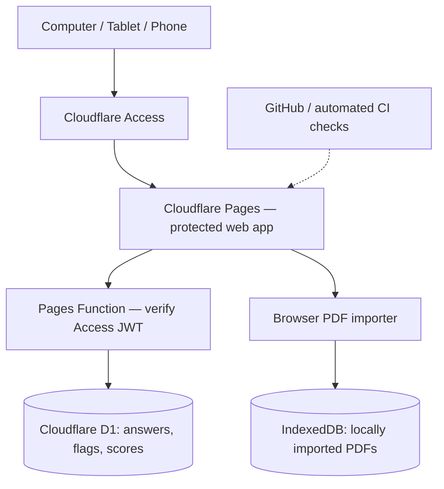

# Security+ Exam Lab
### Zero-Trust Cloud Security & Exam Simulator — Cybersecurity Portfolio Project

**Project status:** Version 1.0 deployed and privately verified · **Focus:** Cloud Security, IAM, Zero Trust, Secure API Development, CI/CD

> **Independent hands-on cybersecurity engineering project.** The live application is protected by Cloudflare Access; this public repository is a **project showcase, not the application's source code or an open-access exam service**. No purchased PDFs, commercial question banks, credentials, or private exam results are distributed here.

## What I built

I developed a responsive Security+ (SY0-701) practice exam application that lets me study, review missed questions, flag difficult topics, and save my progress across a computer, tablet, and phone.

Rather than focusing only on the interface, I designed and tested its **security architecture**: identity-aware access protection, signed-token verification at the API, account-isolated cloud records, conflict-safe progress synchronization, and privacy-conscious handling of licensed study material.

| Capability | Implementation |
|---|---|
| Secure hosting | Cloudflare Pages behind Cloudflare Access |
| Identity / API protection | Server-side Access JWT signature, issuer, audience, and expiry checks |
| Data storage | Cloudflare D1 for **account-scoped exam progress only** |
| Cross-device study | Version-aware answers, flags, attempts, and results synchronization |
| Exam engine | Timed and Study modes, answer review, interactive exercises, manual PBQ scoring |
| Local document privacy | Browser PDF import and IndexedDB; purchased document content stays local |
| Change management | GitHub development and release workflow; nine automated regression suites |

## The engineering challenge

**Problem:** I wanted one realistic study experience across multiple devices, but an older browser tab could overwrite newer answers, and a hosted question bank could expose copyrighted materials or personal progress.

**Solution:** Use Cloudflare Access to protect the site, validate the signed identity at the backend, scope D1 reads and writes to the authenticated user, apply optimistic revision checks to conflicting saves, and separate local PDF documents from cloud-synchronized progress.

**Result:** A functioning protected Production application with synchronized progress and preserved history. The release was verified with actual Cloudflare deployment screens, matching Preview/Production cloud indicators, and previously saved exam attempts.

## Project architecture

**Important security boundary:** Purchased PDF questions, explanations, and pages are **not** hosted on GitHub or stored in D1. The optional R2 cloud-PDF feature is not enabled for purchased content.

## Outcome and validation

- Delivered three personally imported 90-question A/B/C practice exams, each with **85 verified multiple-choice keys and 5 graphical PBQs requiring manual scoring**. These materials are **not** included in this repository.
- Supported a separate locally imported **611-question** practice bank and **1,003-page** study guide.
- Verified all fifteen A/B/C interactive PBQ layouts in the private app.
- Passed nine automated tests covering client behavior, parsing, API authorization, synchronization conflicts, and interactive layouts.
- Deployed the exam engine to an Access-protected Production site; verified existing result history and a matching cloud connection/test signal with Preview.

*This is not an official CompTIA exam, endorsement, or score predictor. The security and functional results described here refer to the owner's tested application and supported workflows.*

## Explore the portfolio

| Document | What it covers |
|---|---|
| [Full case study](docs/PROJECT-CASE-STUDY.md) | Problem, plan, technical design, implementation, challenges, and release |
| [Cloud security architecture](docs/SECURITY-ARCHITECTURE.md) | Zero Trust, identity, trust boundaries, controls, and risk reduction |
| [Testing and verification](docs/TESTING-AND-RESULTS.md) | Automated validation, Production checks, and remaining limitations |
| [Screenshot walkthrough](docs/SCREENSHOT-WALKTHROUGH.md) | Numbered development and Production evidence with privacy notes |
| [Interview talking points](docs/INTERVIEW-GUIDE.md) | Simple 30-second / 90-second explanation and security Q&A |

**Tech stack:** JavaScript • HTML/CSS • Cloudflare Pages • Cloudflare Access • Cloudflare D1 • JWT verification • IndexedDB • GitHub • GitHub Actions

## What I learned

The project reinforced that **an application isn't secure just because it has a login page**. The API must verify authorization, saved data must be isolated to the right user, changes must be tested against real persistence failures, and copyrighted or sensitive material should be stored only where necessary.

## Responsible disclosure and scope

This showcase shares **only documentation and approved sanitized evidence**. The protected Production login, source repository, purchased study documents, personally identifiable account data, test identifiers, and secrets are not made public. A separate public live demo is not offered.

This project is independently developed for learning and professional demonstration and is **not affiliated with or endorsed by CompTIA, Professor Messer, or Messer Studios**. Original company/product names are referenced only to describe the technology and licensed personal study workflow.
