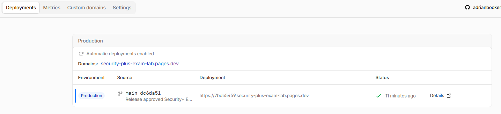
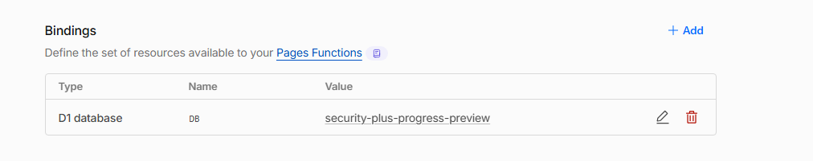
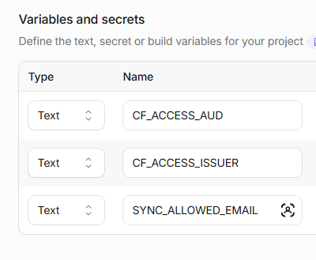
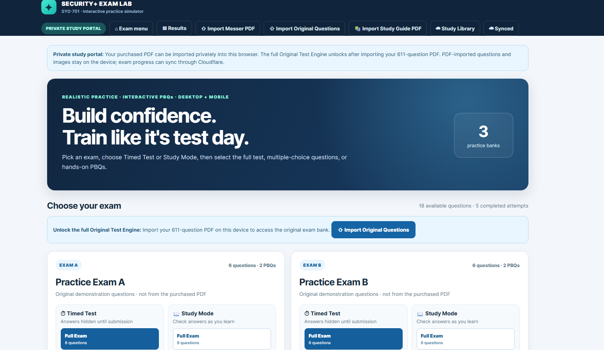
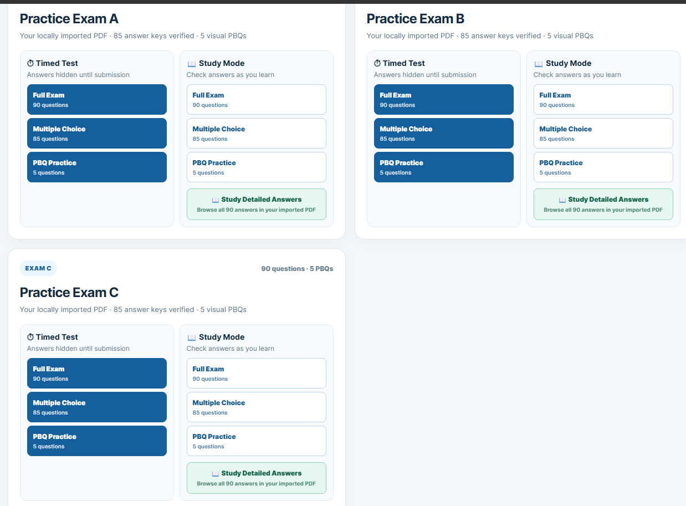
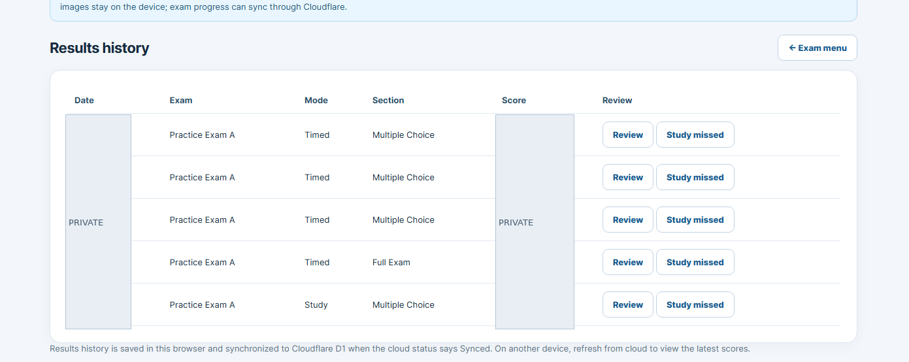
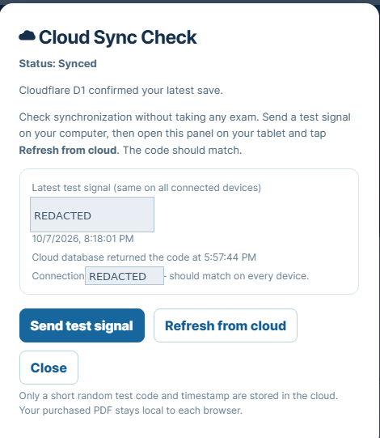
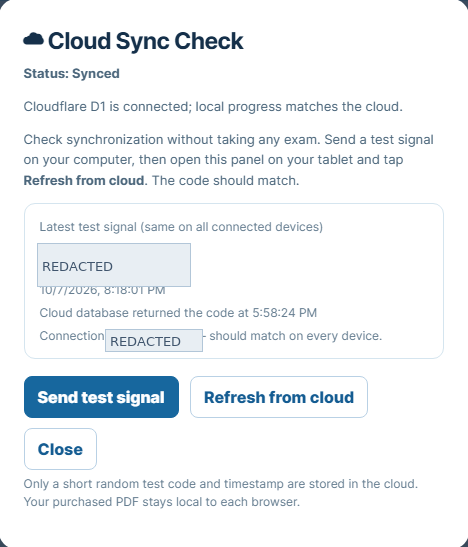
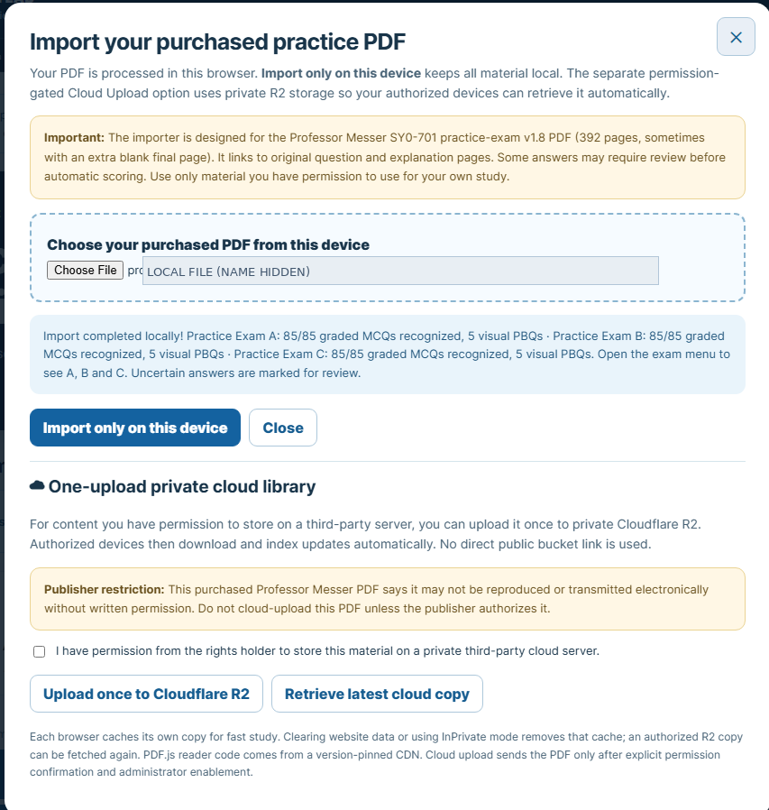

# Project Evidence — From Setup to Production

**Project:** Security+ Exam Lab · **Coverage:** Architecture, Cloudflare deployment, Access protection, D1 progress, exam interface, local imports, and release verification.

This is the public-safe evidence narrative. The original **private** project retains the full 16-image development-to-release sequence. This public repository displays **nine sanitized Production screenshots (08–16)** within the matching release steps below. Early historical screenshots (01–07) are described rather than reposted, so no old account test signals or private details appear publicly.

## Phase 1 — Build the application (historical development steps)

### Step 01. Initial GitHub → Cloudflare Pages deployment
I connected my GitHub project to Cloudflare Pages, confirmed a harmless verification page loaded, and separated testing from the eventual Production application.

### Step 02. Identity-aware access protection
I configured Cloudflare Access applications for the Preview and Production hostnames so the simulator would require an authorized login.

### Step 03. D1 database schema
I created the D1 `user_progress` schema used to persist each authorized user's practice state.

### Step 04. Database binding
I configured the Pages Functions `DB` binding to point to the existing progress database.

### Step 05. Identity configuration
I configured the required Access issuer, application audience, and account-restriction variable **names** through Cloudflare rather than hardcoding their real values.

### Step 06. Exam experience
I built a responsive browser interface with modes for timed exams, study, multiple-choice practice, PBQs, flags, explanations, and results.

### Step 07. Initial synchronization testing
I checked D1 synchronization from authenticated devices and exercised save/resume and reconciliation scenarios. A private historical screenshot contains an unredacted random test code and is deliberately not reproduced here.

## Phase 2 — Verified Production release

These nine real, sanitized project screenshots are now embedded beneath their corresponding release steps. They are not stock illustrations. Sensitive values and licensed question pages are omitted.

### Step 08. Release to Production

*Evidence: successful production deployment from the main branch.*

Cloudflare Pages displayed a successful Production deployment from the GitHub `main` branch.

**Why it matters in cybersecurity:** Controlled releases and clear boundaries between development and Production.

### Step 09. Confirm Production database binding

*Evidence: cloudflare d1 database binding for production.*

Verified the `DB` binding used the pre-existing D1 progress database. No user-data reset or new database was required.

**Why it matters:** Secure backend configuration and non-destructive migration practices.

### Step 10. Verify Production configuration names

*Evidence: cloudflare access environment variable names with values hidden.*

Shows `CF_ACCESS_AUD`, `CF_ACCESS_ISSUER` and `SYNC_ALLOWED_EMAIL` without exposing their actual values.

**Why it matters:** Identity configuration outside application source code; secret hygiene.

### Step 11. Open the protected Production app

*Evidence: protected exam lab production homepage.*

The deployed Security+ Exam Lab loaded with the expected study controls and `Synced` indicator. This is a **demonstration-content homepage** captured before imported personal banks were restored to that browser.

**Why it matters:** Secure delivery of a responsive application.

### Step 12. Verify A, B and C indexes after local import

*Evidence: locally imported practice exam a b and c question counts.*

Local imports showed A/B/C with 90 questions each (85 MCQs and five visual PBQs). The screenshots reveal counts, **not purchased question pages or answers**.

**Why it matters:** Keeping licensed local content separate from cloud progress records.

### Step 13. Confirm saved results remained available

*Evidence: existing exam result entries with private results obscured.*

Five prior exam attempts were visible after Production deployment; personal dates and scores are obscured.

**Why it matters:** Data-integrity checks and preserving existing user progress during change.

### Step 14. Confirm Production cloud synchronization

*Evidence: production cloud sync check with private values redacted.*

The Production Cloud Sync Check reported a synchronized D1 connection. Account identifiers and test code are redacted.

**Why it matters:** Live authenticated integration verification, not merely passing CI.

### Step 15. Compare Preview and Production continuity

*Evidence: preview cloud sync check with private values redacted.*

The Preview Cloud Sync Check was synchronized; original private screens showed matching signal and connection identifiers with Production. Both values remain redacted here.

**Why it matters:** Validating account continuity across deployments.

### Step 16. Confirm local-only PDF import

*Evidence: local pdf import confirmation without original purchased content.*

The importer recognized 85 multiple-choice items and five visual PBQs in each exam. The original document name was hidden. **No R2 document upload was made.**

**Why it matters:** Privacy-by-design and licensing-aware data minimization.

## Evidence safeguards

- **Not included:** purchased PDFs, commercial question screenshots, answer explanations, unredacted Cloudflare credentials, account email, private exam scores, JWTs, and real synchronization identifiers.
- **Not claimed:** official CompTIA endorsement, automatic graphical-PBQ scoring, unrestricted public application access, or successful live R2 storage.
- **Still private:** exam-engine source repository and actual Cloudflare Access-protected study portal.

For the engineering explanation, see the [case study](PROJECT-CASE-STUDY.md), [security architecture](SECURITY-ARCHITECTURE.md), and [test summary](TESTING-AND-RESULTS.md).
