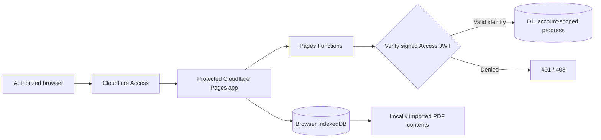

# Cloud Security Architecture and Threat Model

## Why security mattered

Although this is a personal exam simulator, it still handles authenticated sessions and saved exam progress. I built it as a **least-privilege, identity-aware web service** instead of relying on obscurity or a login-page redirect alone.

## Component diagram

The browser can hold licensed material locally; the cloud progress API operates on selected-answer identifiers, flags, attempts, and results, **not purchased PDF text**.

## Trust boundaries

| Trust boundary | Risk | Implemented protection |
|---|---|---|
| Visitor → site | Unapproved visitor loads protected content | Cloudflare Access policies for Preview and Production |
| Browser → API | Forged, expired, or incorrect identity | Signature validation and checks for token issuer, audience, and expiration |
| API → D1 | Access to another user's results | Queries scoped to the verified user's account subject |
| Cross-device state | An old save overwrites newer work | Optimistic revisions, rejection on conflict and merge logic |
| Other site → write endpoint | Cross-origin write requests | Same-origin checks and payload validation |
| Browser → local documents | Leaking purchased questions to hosted assets | Browser PDF import / IndexedDB; no source question content in public GitHub or D1 |
| Optional cloud document path | Unauthorized third-party PDF transmission | Private R2 integration disabled without licensing permission |

## JWT and authorization in plain English

**JWT** stands for *JSON Web Token*. After an authorized sign-in, the backend receives a token with identity claims. The API does not simply trust that token because it exists. It verifies the token's digital signature and checks who issued it, which application it belongs to, and whether it is still valid. Only then does it read or update the saved-progress record belonging to that verified account.

## Why I used Cloudflare D1

D1 gave the server a centralized place to store user progress without requiring a home server. Database access happens through Cloudflare Pages Functions, not through an exposed client-side database key. This design supports multiple devices while maintaining an authorization boundary at the API.

## Why licensed PDFs remain on the device

The app separates data into two classes:

1. **Local documents:** purchased PDF bytes, rendered pages, detailed explanations and locally parsed question references remain in each browser's storage.
2. **Synchronized progress:** answer indexes, attempt position, flags, manual review scores, timestamps, and result history travel through authenticated D1 API calls.

This minimizes what enters third-party cloud storage. It also means importing a purchased document is a **per-device browser task**, even though progress synchronizes.

## Remaining limitations and future hardening

- Cloudflare Access session security still depends on user-device security and account configuration.
- Browser localStorage / IndexedDB are not an independently encrypted vault; clearing site data can remove local study files.
- Third-party frontend dependencies should be periodically audited and protected by strong CSP/SRI strategies.
- Full real-browser and mobile accessibility regression coverage can be expanded.
- Automated mock tests support confidence but never replace actual authenticated Production verification.
- Cloudflare R2 uploads of purchased material are disabled and not claimed as verified.

**Publication boundary:** This document intentionally contains no secret keys, real AUD tags, user email addresses, account IDs, JWTs, licensed question pages, or private login links.
